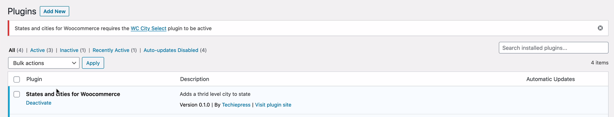

# states and cities for woocommerce

Adds a third level city to state dropdown using WC City Select (https://wordpress.org/plugins/wc-city-select/) plugin.

## Plugins used: 
- https://wordpress.org/plugins/wc-city-select/ 
- https://wordpress.org/plugins/states-cities-and-places-for-woocommerce/

## Requirements
- Add cities to Woocommerce. Needs WC City Select (https://wordpress.org/plugins/wc-city-select/) plugin installed.
- Replace XX with the country code. Instead of YYY, ZZZ use actual state codes.
- Pick countried from https://github.com/woocommerce/woocommerce/blob/master/i18n/countries.php
- Pick states from https://github.com/woocommerce/woocommerce/blob/master/i18n/states.php

## Learn to WordPress add admin notices
How to add an admin notice to a new plugin with a plugin dependency

